 School Management Project

An integrated project for managing schools that covers various aspects such as student management, staff management, classroom assignments, and other related school facilities. The system is designed comprehensively, with the backend programming fully developed, while the user interfaces are still under construction, with some parts already created.

Tools and Technologies Used:

.NET Framework and C# for backend development.

SQL Server and T-SQL for database management.

External libraries for designing user interfaces.

Features:

Automatic error logging in the database for easy issue tracking.

Error logging also in Windows Event Viewer for transparency in system monitoring.  
and another things 

digram img
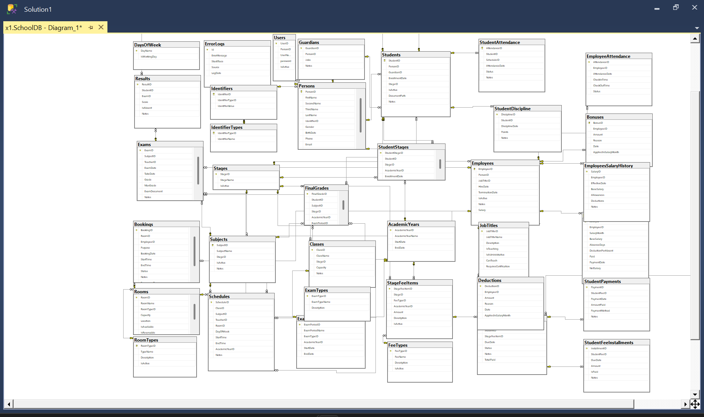

some other pic

| 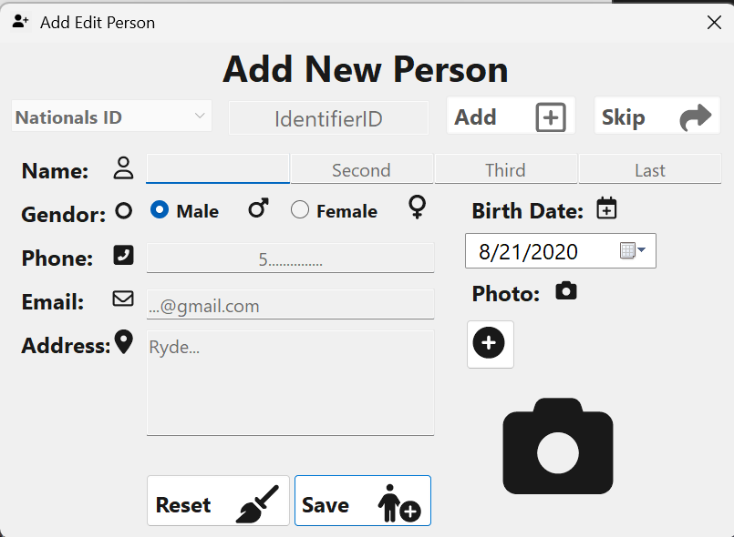 | 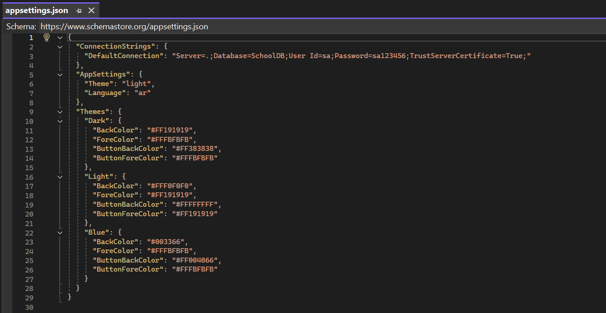 |
|---------------------------------------------|----------------------------------------|
| 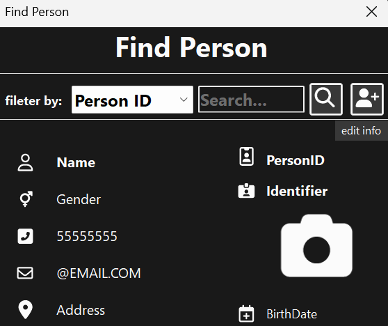      | 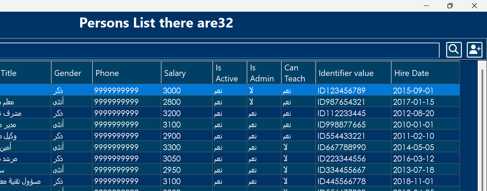    |
| 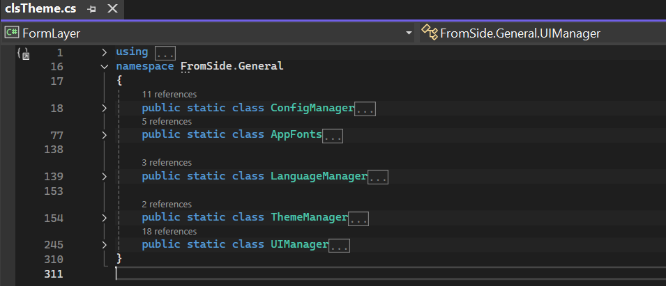    | 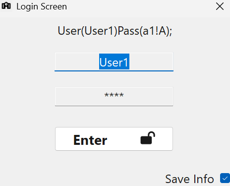         |
| 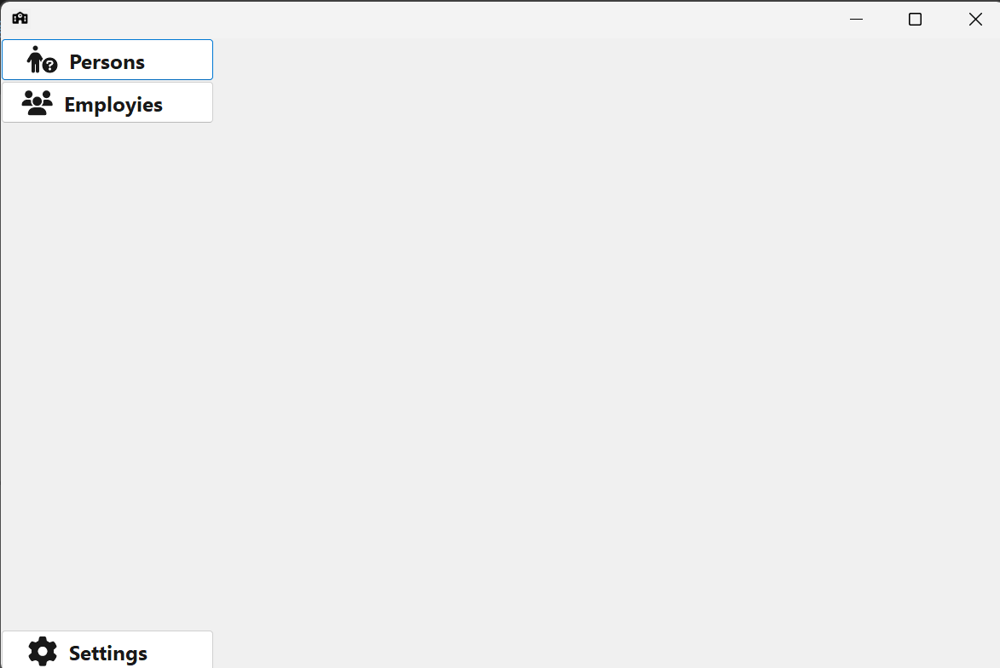       | 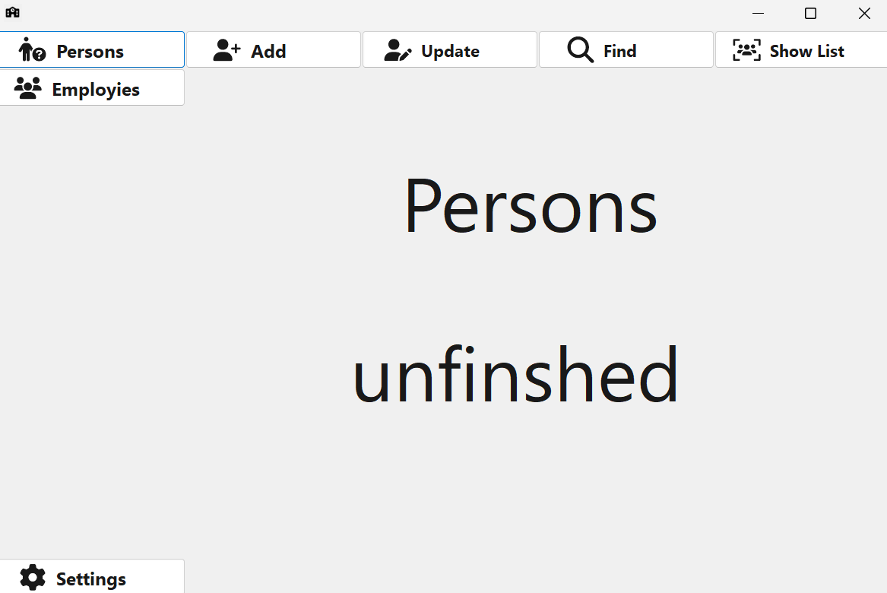|
| 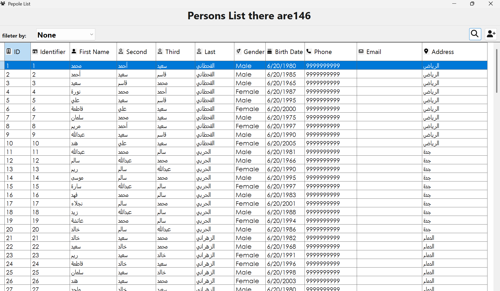 | 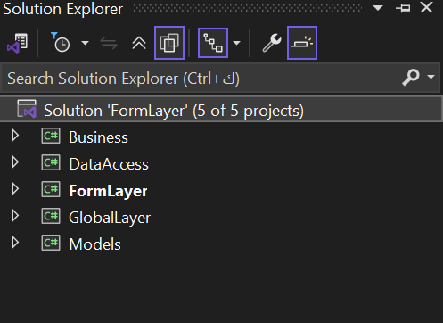 |

